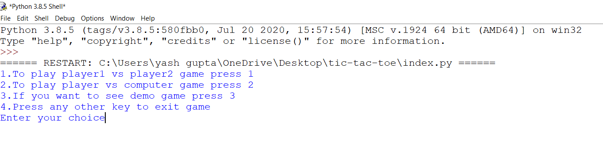
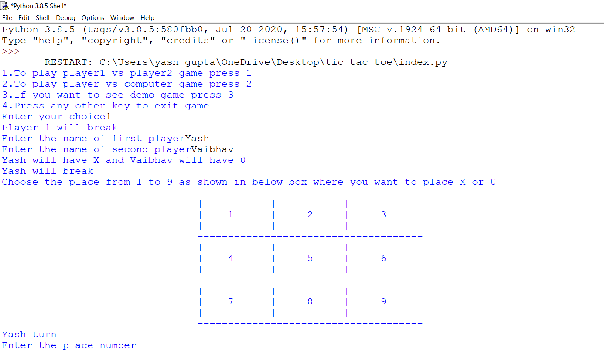
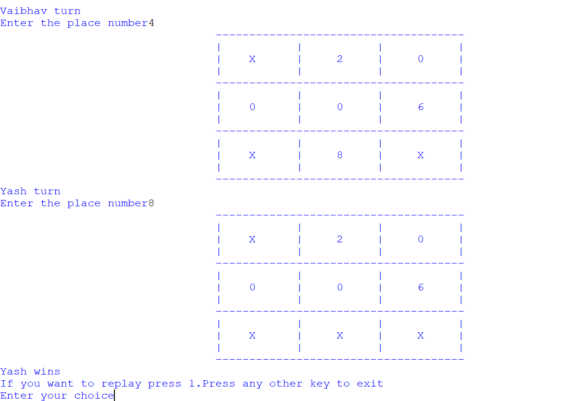
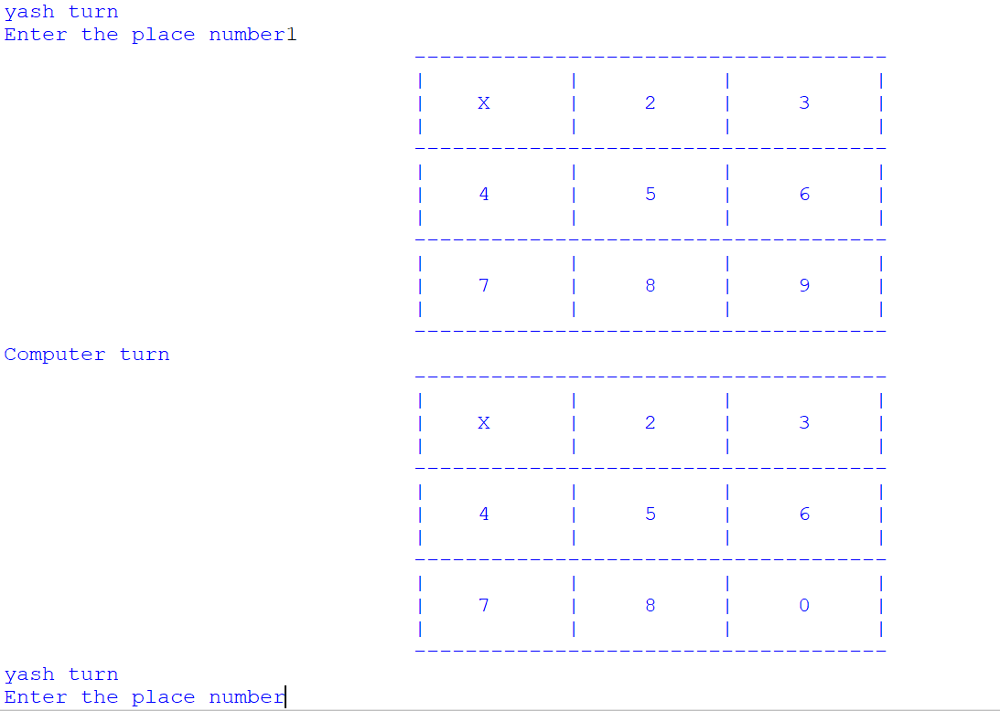
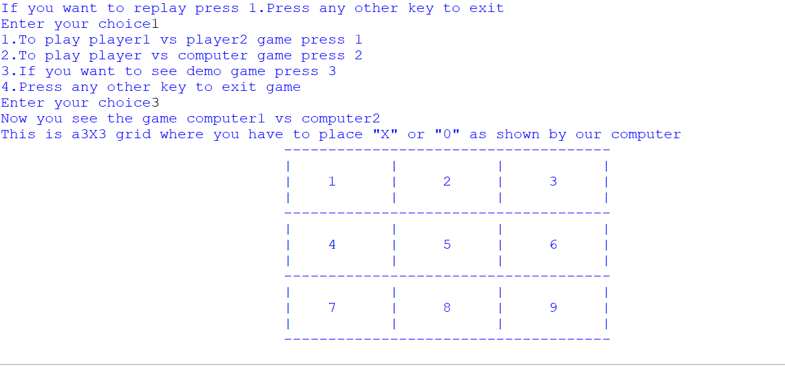

# Tic-Tac-Toe-game
This is a basic Tic-Tac-Toe game designed using the concepts of  very basic, Python. This game only contains some basic functions and if-else concepts.There is a slight use of random and time module.There are basically three modes available in the game which are as follows:-
* Player1 vs Player2
* Player vs Computer
* Computer1 vs Computer2

## How to play?
If you want to play any mode then you simply have to press 1,2 or 3 as you wish and hit enter. If you want to exit, press any other key.This will look as shown in image below:-

* ***If you press 1***
      
     If you press 1 and hit enter the program will ask for names of player1 and player2. After writing names the following screen turns up which will tell whose turn it is (Generally the first player breakes).You have to simply choose the numbers from 1 to 9 and hit enter and it will replace the number with 'X' or '0'. You will see the following output when you run it to this step.
      
     
   When you play the game and reach at last it will tell you who is the winner and **if you want to replay then simply press 1** and same options will come again ,as we can see in the image below:-
   
     

* ***If you press 2***
     If you have pressed 2 and hit enter the program will ask for your name after that the game starts and you will play against computer which will automatically execute it's move.
     
     
     Again if you want to replay then simply press 1 or any other key to exit.
     
* ***If you press 3***
     If you have pressed 3 and hit enter then the program will show you the demo game or the game between computer1 and computer2(It will wait for ten seconds before starting the game). It will run automatically.
     
     

## Error Handling
* If you enter wrong number i.e. numbers other than 1 to 9 then it will discard that move and you have to enter the number again
* If you try to overwrite the move then too it will discard the move and you have to enter again.

     
